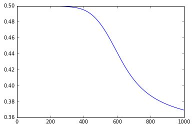
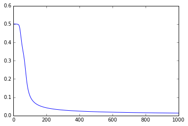
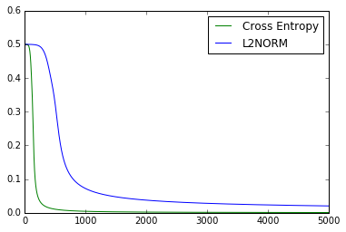
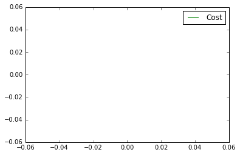

## Imports

    %pylab inline
    import numpy as np
    from tqdm import *

    Populating the interactive namespace from numpy and matplotlib

Initialization
-------------

Set up Hyperparameters
* InputSize
* OutputSize
* HiddenLayerWidth
* HiddenLayerHeight

    class perceptron(object):
        def __init__(self, input_size, output_size, hl_neurons, hl_layers, learningrate):
            self.learningrate = learningrate
            self.input_size = input_size
            self.output_size = output_size
            self.hl_neurons = hl_neurons
            self.hl_layers = hl_layers
            
            # Now setup the weights in this format (inputs x neurons)
            self.weights = []
            self.ths = []
            self.weights.append(np.random.rand(hl_neurons, input_size))
            self.ths.append(np.random.rand(hl_neurons, 1))
            for i in xrange(1, hl_layers):
                self.weights.append(np.random.rand(hl_neurons, hl_neurons))
                self.ths.append(np.random.rand(hl_neurons, 1))
            self.weights.append(np.random.rand(output_size, hl_neurons))
            self.ths.append(np.random.rand(output_size, 1))
            self.delta_func = self.delta_func1
            self.sigmoid = numpy.vectorize(self.sigmoid)
            self.sigmoid_delta = numpy.vectorize(self.sigmoid_delta)
            
        def delta_func1(self, output, truths):
            return (output-truths)
        
        def sigmoid(self, z):
            return 1/(1+np.exp(-z))
        
        def sigmoid_delta(self, z):
            return (np.exp(-z))/((1+np.exp(-z))**2)
        
        def push_forward(self, inputs):
            A = []
            Z = []
            output = inputs
            for i in xrange(0, len(self.weights)):
    #             print "performing %f * %f + %f" % (np.max(self.weights[i]), np.max(output), np.max(self.ths[i]))
                normno = len(output)
                output = np.dot(self.weights[i], output)
                output /= normno
    #             print "Dividing by %d neurons" % normno
                output += self.ths[i]
                Z.append(output)
                output = self.sigmoid(output)
                A.append(output)
            return A, Z, output
        
        def feed_forward(self, inputs):
            print "input = %s" % (inputs)
            _, _, output = self.push_forward(inputs)
            return output
        
        def multiply_and_average(self, delta, A):
            At = np.transpose(A)
            # Multiply the two, see if they're compatible (faster than throwing an exception)
            _ = np.dot(delta,At)
            ws = []
            for i in xrange(0, len(delta[0])):
                di = delta[:,[i]]
                Ai = At[[i],:]
                ws.append(np.dot(di, Ai))
            return np.mean(ws,axis=0)
        
        def train(self, inputs, truths):
            # First get the error and delta for output layer
            A, Z, output = self.push_forward(inputs)
    #         curdelta = np.multiply((output - truths),self.sigmoid_delta(Z[len(Z)-1]))
            curdelta = np.multiply(self.delta_func(output, truths),self.sigmoid_delta(Z[len(Z)-1]))
            deltas = [curdelta]
            for i in reversed(xrange(0, len(self.weights)-1)):
                curdelta = np.multiply(np.dot(np.transpose(self.weights[i+1]), curdelta),
                                       self.sigmoid_delta(Z[i]))
                deltas.insert(0, curdelta)        
            A.insert(0,inputs)
            for i in reversed(xrange(0, len(self.weights))):
                self.weights[i] -= (self.learningrate * np.dot(deltas[i], A[i].T))
                tmp = np.mean(deltas[i],axis=1)
                tmp = np.matrix(tmp)
                tmp = tmp.T
                try:
                    self.ths[i] -= (self.learningrate * tmp)
                except ValueError:
    #                 print "tmp - %s" % tmp
    #                 print "ths - %s" % self.ths[i]
                    self.ths[i] -= (self.learningrate * tmp.T)
                
            return np.mean(abs(truths - output))

Testing Input (AND)
---------
Sample truth table for AND:

A | B | **Output**
--- | --- | ---
0 | 0 | 0
0 | 1 | 0
1 | 0 | 0
1 | 1 | 1

    input_XOR = np.transpose(np.array([[0,0],[0,1],[1,0],[1,1]]))
    gtruth_XOR = np.transpose(np.array([[0],[1],[1],[0]]))
    input_AND = np.transpose(np.array([[0,0],[0,1],[1,0],[1,1]]))
    gtruth_AND = np.transpose(np.array([[0],[0],[0],[1]]))

    %%time
    np.random.seed(1)
    pp = perceptron(2, 1, 1, 1, 1.0)
    results = []
    for i in xrange(0, 1000): results.append(pp.train(input_XOR, gtruth_XOR))
    plot(results)
    print "Final Results: %s" % pp.feed_forward(input_XOR)

    Final Results: [[ 0.12342281  0.65636643  0.65635293  0.66577607]]
    Wall time: 253 ms

We can clearly see the training fail here, when we're training for XOR with only one neuron in the hidden layer, and the training fails. Let's try with two neurons:

    %%time
    np.random.seed(1)
    pp2 = perceptron(2, 1, 3, 1, 10)
    plot([(pp2.train(input_XOR, gtruth_XOR)) for i in tqdm(xrange(0, 1000))])
    print "Final Results = %s" % pp2.feed_forward(input_XOR)

    100%|████████████████████████████████████████████████████████████████████████████| 1000/1000 [00:00<00:00, 3571.43it/s]

    Final Results = [[ 0.00700684  0.9878664   0.98749202  0.02203125]]
    Wall time: 314 ms

The results look much better now.

    pp2.feed_forward([[1],[0]])

    array([[ 0.98749202]])

Cross Entropy
------------

Now let us try modifying the cost function, see if we can't speed up computation a bit.
The ordinary cost derivative being used is:
$$\frac{dE}{dA} = (a-y)$$
Cross entropy uses the following function:
$$\frac{dE}{dA} = \frac{a-y}{a(1-a)}$$

    def cross_delta(output, truths):
        return (output - truths)/(np.multiply(output,(1-output)))

    %%time
    np.random.seed(2)
    pp2 = perceptron(2, 1, 3, 1, 1)
    np.random.seed(2)
    pp3 = perceptron(2, 1, 3, 1, 1)
    pp3.delta_func = cross_delta
    plot([(pp3.train(input_XOR, gtruth_XOR)) for i in xrange(0, 5000)], "green",label = "Cross Entropy")
    plot([(pp2.train(input_XOR, gtruth_XOR)) for i in xrange(0, 5000)], "blue", label = "L2NORM")
    legend()
    print "Cross Entropy Final Results = %s" % pp3.feed_forward(input_XOR)
    print "L2NORM        Final Results = %s" % pp2.feed_forward(input_XOR)

    Cross Entropy Final Results = [[  2.53993659e-05   9.99107935e-01   9.99106532e-01   1.29625199e-03]]
    L2NORM        Final Results = [[ 0.00718332  0.97689461  0.97684651  0.02786687]]
    Wall time: 2.4 s

We can clearly see the difference in training speed and training time.

Digit Classification
----

Now let's load some MNIST digits and attempt classification. We'll use the MNIST package to make loading from the compressed files easier.

    from mnist import MNIST
    mndata = MNIST('mnist')
    data = mndata.load_training()

    training_images = data[0]
    training_labels = data[1]

Now we can attempt to create a neural net that can process the data. First thing is something to convert label data into useful ground truths for the perceptron, as well as some input processing to normalize input data.

    def out_process(digit):
        outv = np.zeros(10)
        outv[digit] = 1
        return outv
    def in_process(inval):
        return inval/255.0

    np.random.seed(1)
    mnist_pp = perceptron(len(training_images[0]), 10, 15, 2, 0.1)

    ## Reshape and fit training data
    # selection_max = 100
    selection_max = len(training_images)
    def load_images(inp, selection_max, T=True):
        if(selection_max == -1): selection_max = len(inp)
        if(T):
            return in_process(np.matrix(inp[0:selection_max]).T)
        else:
            return in_process(np.matrix(inp[0:selection_max]).T)
    
    training_data = load_images(training_images, selection_max)

    ## Reshape and fit labels
    def load_labels(inp, selection_max):
        return numpy.apply_along_axis(func1d=out_process, arr=np.matrix(inp[0:selection_max]), axis=0)
    training_data_l = load_labels(training_labels, selection_max)

    %%time
    ## Testing feed forward
    y = mnist_pp.feed_forward(training_data)

    Wall time: 3.77 s

    error = y - training_data_l
    print y.shape
    print training_data_l.shape
    _, _, output = mnist_pp.push_forward(training_data)
    print np.mean(abs(training_data_l - output))

    (10L, 60000L)
    (10L, 60000L)
    0.899602980018

    %%time
    ## Fingers crossed, try training
    plot([(mnist_pp.train(training_data, training_data_l)) for i in tqdm(xrange(0, 1000))], "green",label = "Cost")
    legend()

      0%|▏                                                                                     | 2/1000 [00:21<2:57:32, 10.67s/it]C:\Program Files\Anaconda2\lib\site-packages\ipykernel\__main__.py:27: RuntimeWarning: overflow encountered in exp
    C:\Program Files\Anaconda2\lib\site-packages\ipykernel\__main__.py:30: RuntimeWarning: overflow encountered in exp
    C:\Program Files\Anaconda2\lib\site-packages\ipykernel\__main__.py:30: RuntimeWarning: invalid value encountered in double_scalars
      1%|▌                                                                                     | 6/1000 [01:21<3:56:23, 14.27s/it]

For the safety of time, let's start using cross entropy.

    %%time
    np.random.seed(1)
    mnist_pp2 = perceptron(len(training_images[0]), 10, 15, 2, 0.1)
    mnist_pp2.delta_func = cross_delta

    Wall time: 0 ns

%%time
res = [float((mnist_pp2.train(training_data, training_data_l))) for i in tqdm(xrange(0, 10000))]
plot(res, "green",label = "Cost")
legend()

Since the dataset is large, and training takes an inordinate amount of time, we need to try other methods.

## Mini-Batch Gradient Descent

    def getbatch(training_set, training_set_l, batch_size=50):
        l, b = training_set.shape
        selection = np.random.randint(0,b, size=batch_size)
        return (training_set[:,np.array(selection)], training_set_l[:,np.array(selection)])
    a, b = getbatch(training_data, training_data_l, 50)
    print a.shape
    print b.shape

    (784L, 50L)
    (10L, 50L)

    print len(training_data[:, :])
    training_data.shape

    784

    (784L, 60000L)

    ## Check shapes
    print training_data[1,2]
    print training_data.shape
    print training_data_l.shape

    0.0
    (784L, 60000L)
    (10L, 60000L)

Now, we can start training. Let's try a batch size of 50 over 1000 tries.

    np.random.seed(1)
    mnist_pp3 = perceptron(len(training_images[0]), 10, 10, 4, 10)
    # mnist_pp3.delta_func = cross_delta

    %%time
    res = [(mnist_pp3.train(*(getbatch(training_data, training_data_l, 1)))) for i in tqdm(xrange(0, 1))]
    plot(res, "green",label = "Cost")
    legend()

      0%|                                                                                            | 0/1 [00:00<?, ?it/s]C:\Users\hrish\AppData\Local\Enthought\Canopy\User\lib\site-packages\ipykernel\__main__.py:30: RuntimeWarning: invalid value encountered in double_scalars
    100%|███████████████████████████████████████████████████████████████████████████████████| 1/1 [00:00<00:00, 499.98it/s]

    Wall time: 40 ms

    

    t, tl = getbatch(training_data, training_data_l, 3)

    res

    [0.67871356978686581,
     0.25667445874395528,
     0.10414331615370873,
     nan,
     nan,
     nan,
     nan,
     nan,
     nan,
     nan,
     nan,
     nan,
     nan,
     nan,
     nan,
     nan,
     nan,
     nan,
     nan,
     nan,
     nan,
     nan,
     nan,
     nan,
     nan,
     nan,
     nan,
     nan,
     nan,
     nan,
     nan,
     nan,
     nan,
     nan,
     nan,
     nan,
     nan,
     nan,
     nan,
     nan,
     nan,
     nan,
     nan,
     nan,
     nan,
     nan,
     nan,
     nan,
     nan,
     nan,
     nan,
     nan,
     nan,
     nan,
     nan,
     nan,
     nan,
     nan,
     nan,
     nan,
     nan,
     nan,
     nan,
     nan,
     nan,
     nan,
     nan,
     nan,
     nan,
     nan,
     nan,
     nan,
     nan,
     nan,
     nan,
     nan,
     nan,
     nan,
     nan,
     nan,
     nan,
     nan,
     nan,
     nan,
     nan,
     nan,
     nan,
     nan,
     nan,
     nan,
     nan,
     nan,
     nan,
     nan,
     nan,
     nan,
     nan,
     nan,
     nan,
     nan,
     nan,
     nan,
     nan,
     nan,
     nan,
     nan,
     nan,
     nan,
     nan,
     nan,
     nan,
     nan,
     nan,
     nan,
     nan,
     nan,
     nan,
     nan,
     nan,
     nan,
     nan,
     nan,
     nan,
     nan,
     nan,
     nan,
     nan,
     nan,
     nan,
     nan,
     nan,
     nan,
     nan,
     nan,
     nan,
     nan,
     nan,
     nan,
     nan,
     nan,
     nan,
     nan,
     nan,
     nan,
     nan,
     nan,
     nan,
     nan,
     nan,
     nan,
     nan,
     nan,
     nan,
     nan,
     nan,
     nan,
     nan,
     nan,
     nan,
     nan,
     nan,
     nan,
     nan,
     nan,
     nan,
     nan,
     nan,
     nan,
     nan,
     nan,
     nan,
     nan,
     nan,
     nan,
     nan,
     nan,
     nan,
     nan,
     nan,
     nan,
     nan,
     nan,
     nan,
     nan,
     nan,
     nan,
     nan,
     nan,
     nan,
     nan,
     nan,
     nan,
     nan,
     nan,
     nan,
     nan,
     nan,
     nan,
     nan,
     nan,
     nan,
     nan,
     nan,
     nan,
     nan,
     nan,
     nan,
     nan,
     nan,
     nan,
     nan,
     nan,
     nan,
     nan,
     nan,
     nan,
     nan,
     nan,
     nan,
     nan,
     nan,
     nan,
     nan,
     nan,
     nan,
     nan,
     nan,
     nan,
     nan,
     nan,
     nan,
     nan,
     nan,
     nan,
     nan,
     nan,
     nan,
     nan,
     nan,
     nan,
     nan,
     nan,
     nan,
     nan,
     nan,
     nan,
     nan,
     nan,
     nan,
     nan,
     nan,
     nan,
     nan,
     nan,
     nan,
     nan,
     nan,
     nan,
     nan,
     nan,
     nan,
     nan,
     nan,
     nan,
     nan,
     nan,
     nan,
     nan,
     nan,
     nan,
     nan,
     nan,
     nan,
     nan,
     nan,
     nan,
     nan,
     nan,
     nan,
     nan,
     nan,
     nan,
     nan,
     nan,
     nan,
     nan,
     nan,
     nan,
     nan,
     nan,
     nan,
     nan,
     nan,
     nan,
     nan,
     nan,
     nan,
     nan,
     nan,
     nan,
     nan,
     nan,
     nan,
     nan,
     nan,
     nan,
     nan,
     nan,
     nan,
     nan,
     nan,
     nan,
     nan,
     nan,
     nan,
     nan,
     nan,
     nan,
     nan,
     nan,
     nan,
     nan,
     nan,
     nan,
     nan,
     nan,
     nan,
     nan,
     nan,
     nan,
     nan,
     nan,
     nan,
     nan,
     nan,
     nan,
     nan,
     nan,
     nan,
     nan,
     nan,
     nan,
     nan,
     nan,
     nan,
     nan,
     nan,
     nan,
     nan,
     nan,
     nan,
     nan,
     nan,
     nan,
     nan,
     nan,
     nan,
     nan,
     nan,
     nan,
     nan,
     nan,
     nan,
     nan,
     nan,
     nan,
     nan,
     nan,
     nan,
     nan,
     nan,
     nan,
     nan,
     nan,
     nan,
     nan,
     nan,
     nan,
     nan,
     nan,
     nan,
     nan,
     nan,
     nan,
     nan,
     nan,
     nan,
     nan,
     nan,
     nan,
     nan,
     nan,
     nan,
     nan,
     nan,
     nan,
     nan,
     nan,
     nan,
     nan,
     nan,
     nan,
     nan,
     nan,
     nan,
     nan,
     nan,
     nan,
     nan,
     nan,
     nan,
     nan,
     nan,
     nan,
     nan,
     nan,
     nan,
     nan,
     nan,
     nan,
     nan,
     nan,
     nan,
     nan,
     nan,
     nan,
     nan,
     nan,
     nan,
     nan,
     nan,
     nan,
     nan,
     nan,
     nan,
     nan,
     nan,
     nan,
     nan,
     nan,
     nan,
     nan,
     nan,
     nan,
     nan,
     nan,
     nan,
     nan,
     nan,
     nan,
     nan,
     nan,
     nan,
     nan,
     nan,
     nan,
     nan,
     nan,
     nan,
     nan,
     nan,
     nan,
     nan,
     nan,
     nan,
     nan,
     nan,
     nan,
     nan,
     nan,
     nan,
     nan,
     nan,
     nan,
     nan,
     nan,
     nan,
     nan,
     nan,
     nan,
     nan,
     nan,
     nan,
     nan,
     nan,
     nan,
     nan,
     nan,
     nan,
     nan,
     nan,
     nan,
     nan,
     nan,
     nan,
     nan,
     nan,
     nan,
     nan,
     nan,
     nan,
     nan,
     nan,
     nan,
     nan,
     nan,
     nan,
     nan,
     nan,
     nan,
     nan,
     nan,
     nan,
     nan,
     nan,
     nan,
     nan,
     nan,
     nan,
     nan,
     nan,
     nan,
     nan,
     nan,
     nan,
     nan,
     nan,
     nan,
     nan,
     nan,
     nan,
     nan,
     nan,
     nan,
     nan,
     nan,
     nan,
     nan,
     nan,
     nan,
     nan,
     nan,
     nan,
     nan,
     nan,
     nan,
     nan,
     nan,
     nan,
     nan,
     nan,
     nan,
     nan,
     nan,
     nan,
     nan,
     nan,
     nan,
     nan,
     nan,
     nan,
     nan,
     nan,
     nan,
     nan,
     nan,
     nan,
     nan,
     nan,
     nan,
     nan,
     nan,
     nan,
     nan,
     nan,
     nan,
     nan,
     nan,
     nan,
     nan,
     nan,
     nan,
     nan,
     nan,
     nan,
     nan,
     nan,
     nan,
     nan,
     nan,
     nan,
     nan,
     nan,
     nan,
     nan,
     nan,
     nan,
     nan,
     nan,
     nan,
     nan,
     nan,
     nan,
     nan,
     nan,
     nan,
     nan,
     nan,
     nan,
     nan,
     nan,
     nan,
     nan,
     nan,
     nan,
     nan,
     nan,
     nan,
     nan,
     nan,
     nan,
     nan,
     nan,
     nan,
     nan,
     nan,
     nan,
     nan,
     nan,
     nan,
     nan,
     nan,
     nan,
     nan,
     nan,
     nan,
     nan,
     nan,
     nan,
     nan,
     nan,
     nan,
     nan,
     nan,
     nan,
     nan,
     nan,
     nan,
     nan,
     nan,
     nan,
     nan,
     nan,
     nan,
     nan,
     nan,
     nan,
     nan,
     nan,
     nan,
     nan,
     nan,
     nan,
     nan,
     nan,
     nan,
     nan,
     nan,
     nan,
     nan,
     nan,
     nan,
     nan,
     nan,
     nan,
     nan,
     nan,
     nan,
     nan,
     nan,
     nan,
     nan,
     nan,
     nan,
     nan,
     nan,
     nan,
     nan,
     nan,
     nan,
     nan,
     nan,
     nan,
     nan,
     nan,
     nan,
     nan,
     nan,
     nan,
     nan,
     nan,
     nan,
     nan,
     nan,
     nan,
     nan,
     nan,
     nan,
     nan,
     nan,
     nan,
     nan,
     nan,
     nan,
     nan,
     nan,
     nan,
     nan,
     nan,
     nan,
     nan,
     nan,
     nan,
     nan,
     nan,
     nan,
     nan,
     nan,
     nan,
     nan,
     nan,
     nan,
     nan,
     nan,
     nan,
     nan,
     nan,
     nan,
     nan,
     nan,
     nan,
     nan,
     nan,
     nan,
     nan,
     nan,
     nan,
     nan,
     nan,
     nan,
     nan,
     nan,
     nan,
     nan,
     nan,
     nan,
     nan,
     nan,
     nan,
     nan,
     nan,
     nan,
     nan,
     nan,
     nan,
     nan,
     nan,
     nan,
     nan,
     nan,
     nan,
     nan,
     nan,
     nan,
     nan,
     nan,
     nan,
     nan,
     nan,
     nan,
     nan,
     nan,
     nan,
     nan,
     nan,
     nan,
     nan,
     nan,
     nan,
     nan,
     nan,
     nan,
     nan,
     nan,
     nan,
     nan,
     nan,
     nan,
     nan,
     nan,
     nan,
     nan,
     nan,
     nan,
     nan,
     nan,
     nan,
     nan,
     nan,
     nan,
     nan,
     nan,
     nan,
     nan,
     nan,
     nan,
     nan,
     nan,
     nan,
     nan,
     nan,
     nan,
     nan,
     nan,
     nan,
     nan,
     nan,
     nan,
     nan,
     nan,
     nan,
     nan,
     nan,
     nan,
     nan,
     nan,
     nan,
     nan,
     nan,
     nan,
     nan,
     nan,
     nan,
     nan,
     nan,
     nan,
     nan,
     nan,
     nan,
     nan,
     nan,
     nan,
     nan,
     nan,
     nan,
     nan,
     nan,
     nan,
     nan,
     nan,
     nan,
     nan,
     nan,
     nan,
     nan,
     nan,
     nan,
     nan,
     nan,
     nan,
     nan,
     nan,
     nan,
     nan,
     nan,
     nan,
     nan,
     nan,
     nan,
     nan,
     nan,
     nan,
     nan,
     nan,
     nan,
     nan,
     nan,
     nan,
     nan,
     nan,
     nan,
     nan,
     nan,
     nan,
     nan,
     nan,
     nan,
     nan,
     nan,
     nan,
     nan,
     nan,
     nan,
     nan,
     nan,
     nan,
     nan,
     nan,
     nan,
     nan,
     nan,
     nan,
     nan,
     nan,
     nan,
     nan,
     nan,
     nan,
     nan,
     nan,
     nan,
     nan,
     nan,
     nan,
     nan,
     nan,
     nan,
     nan,
     nan,
     nan,
     nan,
     nan,
     nan,
     nan,
     nan,
     nan,
     nan,
     nan,
     nan,
     nan,
     nan,
     nan,
     nan,
     nan,
     nan,
     nan,
     nan,
     nan,
     nan,
     nan,
     nan,
     nan,
     nan,
     nan,
     nan,
     nan,
     nan,
     nan,
     nan,
     nan,
     nan,
     nan,
     nan,
     nan,
     nan,
     nan,
     nan,
     nan,
     nan,
     nan,
     nan,
     nan,
     nan,
     nan,
     nan,
     nan,
     nan,
     nan,
     nan,
     nan,
     nan,
     nan,
     nan,
     nan,
     nan,
     nan,
     nan,
     nan,
     nan,
     nan,
     nan,
     nan,
     nan,
     nan,
     nan,
     nan,
     nan,
     nan,
     nan,
     nan]

    

    

    mnist_pp3.feed_forward(training_data[:,1:4])

    input = [[ 0.  0.  0.]
     [ 0.  0.  0.]
     [ 0.  0.  0.]
     ..., 
     [ 0.  0.  0.]
     [ 0.  0.  0.]
     [ 0.  0.  0.]]

    matrix([[ nan,  nan,  nan],
            [ nan,  nan,  nan],
            [ nan,  nan,  nan],
            [ nan,  nan,  nan],
            [ nan,  nan,  nan],
            [ nan,  nan,  nan],
            [ nan,  nan,  nan],
            [ nan,  nan,  nan],
            [ nan,  nan,  nan],
            [ nan,  nan,  nan]])

    a, z, output = mnist_pp3.push_forward(training_data[:,1:4])
    for i in xrange(0, len(a)): print "a[%d]: %s" % (i, a[i])
    for i in xrange(0, len(z)): print "z[%d]: %s" % (i, z[i])

    Dividing by 784 neurons
    Dividing by 10 neurons
    Dividing by 10 neurons
    Dividing by 10 neurons
    Dividing by 10 neurons
    a[0]: [[ 0.32316022  0.338594    0.33348225]
     [ 0.27188617  0.28907415  0.28580044]
     [ 0.52441801  0.53393797  0.5304523 ]
     [ 0.22596119  0.23928328  0.23686373]
     [ 0.4344431   0.4485956   0.44579932]
     [ 0.10528021  0.11585239  0.11407259]
     [ 0.34125604  0.35742485  0.35429641]
     [ 0.3045872   0.31500539  0.31103056]
     [ 0.16416333  0.1760405   0.17316591]
     [ 0.18213741  0.19356041  0.19131405]]
    a[1]: [[ 0.12833022  0.12783261  0.12797537]
     [ 0.27555196  0.27439401  0.27470415]
     [ 0.16855674  0.16775356  0.16793113]
     [ 0.153762    0.15296163  0.15316397]
     [ 0.15389297  0.15263569  0.1529381 ]
     [ 0.20207071  0.2012792   0.20146544]
     [ 0.11551598  0.11468809  0.11489005]
     [ 0.18482193  0.18390908  0.18412064]
     [ 0.19473969  0.19407884  0.19426173]
     [ 0.2647457   0.26344189  0.26377597]]
    a[2]: [[ 0.69943092  0.69941225  0.69941714]
     [ 0.94112174  0.94108901  0.94109722]
     [ 0.84732853  0.84729871  0.84730644]
     [ 0.60697187  0.60696507  0.6069671 ]
     [ 0.87960335  0.87958072  0.8795863 ]
     [ 0.65479673  0.65481405  0.6548099 ]
     [ 0.44460416  0.44469342  0.44467073]
     [ 0.79388339  0.79389084  0.79388914]
     [ 0.41552824  0.41563805  0.41561038]
     [ 0.92406761  0.924034    0.92404232]]
    a[3]: [[ 0.03000681  0.03000686  0.03000685]
     [ 0.02907486  0.02907496  0.02907493]
     [ 0.0286179   0.02861787  0.02861787]
     [ 0.02891617  0.02891627  0.02891624]
     [ 0.03154338  0.0315436   0.03154354]
     [ 0.02914206  0.02914227  0.02914221]
     [ 0.03084044  0.03084082  0.03084072]
     [ 0.03006713  0.03006747  0.03006738]
     [ 0.03011674  0.03011685  0.03011682]
     [ 0.02788249  0.02788259  0.02788256]]
    a[4]: [[ 0.09217606  0.09217605  0.09217605]
     [ 0.08453185  0.08453183  0.08453184]
     [ 0.04700215  0.04700215  0.04700215]
     [ 0.09736734  0.09736733  0.09736733]
     [ 0.04297931  0.04297931  0.04297931]
     [ 0.05324621  0.05324621  0.05324621]
     [ 0.03985617  0.03985617  0.03985617]
     [ 0.12095635  0.12095633  0.12095633]
     [ 0.04916782  0.04916782  0.04916782]
     [ 0.0953319   0.09533189  0.09533189]]
    z[0]: [[-0.73928633 -0.66956612 -0.69247714]
     [-0.98507392 -0.89988492 -0.91586861]
     [ 0.0977498   0.13596093  0.12196015]
     [-1.23125873 -1.15661294 -1.1699516 ]
     [-0.26374591 -0.20634666 -0.21765796]
     [-2.13988511 -2.03230716 -2.04980006]
     [-0.65770187 -0.58655863 -0.60020668]
     [-0.8255482  -0.77682123 -0.79530574]
     [-1.62757137 -1.54340729 -1.56335391]
     [-1.50193294 -1.42703934 -1.44149435]]
    z[1]: [[-1.91580386 -1.92025972 -1.91897984]
     [-0.96663383 -0.97244208 -0.97088492]
     [-1.59589065 -1.60163263 -1.60036123]
     [-1.70539469 -1.71155892 -1.70999805]
     [-1.70438851 -1.71407672 -1.71174051]
     [-1.37340227 -1.37831846 -1.3771604 ]
     [-2.03559556 -2.04372387 -2.04173629]
     [-1.48401379 -1.49008428 -1.48867533]
     [-1.41950186 -1.42372142 -1.42255257]
     [-1.02144666 -1.02815534 -1.02643432]]
    z[2]: [[ 0.84458941  0.84450062  0.84452386]
     [ 2.77160064  2.77101008  2.7711582 ]
     [ 1.71380012  1.71356963  1.71362937]
     [ 0.43460127  0.43457275  0.43458127]
     [ 1.98867935  1.98846571  1.98851835]
     [ 0.64019141  0.64026805  0.64024968]
     [-0.22249673 -0.22213528 -0.22222713]
     [ 1.34849452  1.34854006  1.34852964]
     [-0.34115787 -0.34070575 -0.34081967]
     [ 2.49894197  2.49846302  2.49858151]]
    z[3]: [[-3.47586483 -3.47586289 -3.47586344]
     [-3.50837547 -3.50837204 -3.50837295]
     [-3.52468748 -3.52468872 -3.52468849]
     [-3.51401182 -3.51400825 -3.5140092 ]
     [-3.42434006 -3.42433276 -3.42433463]
     [-3.5059978  -3.50599028 -3.50599222]
     [-3.44760238 -3.44758978 -3.447593  ]
     [-3.47379446 -3.47378262 -3.47378567]
     [-3.47209462 -3.47209069 -3.47209173]
     [-3.55147784 -3.55147425 -3.55147518]]
    z[4]: [[-2.28735005 -2.28735019 -2.28735015]
     [-2.38230722 -2.38230738 -2.38230734]
     [-3.00941925 -3.0094194  -3.00941936]
     [-2.22682486 -2.22682498 -2.22682495]
     [-3.10310616 -3.10310627 -3.10310624]
     [-2.87811249 -2.87811253 -2.87811252]
     [-3.18180576 -3.18180592 -3.18180588]
     [-1.98340485 -1.983405   -1.98340496]
     [-2.96209816 -2.96209833 -2.96209829]
     [-2.25020365 -2.25020374 -2.25020372]]

    
